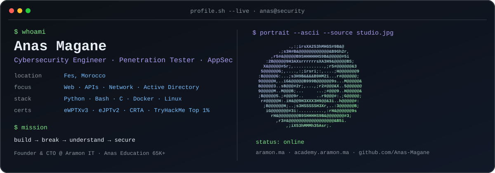
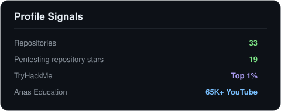
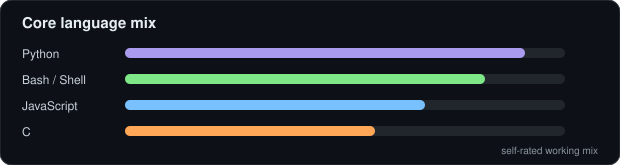

<picture>
  <source media="(prefers-color-scheme: dark)" srcset="assets/emmi-style-banner-dark.svg">
  <source media="(prefers-color-scheme: light)" srcset="assets/emmi-style-banner-light.svg">
  
</picture>

 

 

&nbsp;&nbsp;
&nbsp;&nbsp;
&nbsp;&nbsp;

 

---

## This is me :)

Hi, I'm **Anas Magane**, a cybersecurity engineer, penetration tester and AppSec practitioner based in **Fes, Morocco**.
I break systems to understand them, then turn what I learn into better security, automation, labs and practical education.

- 🛡️ **Founder & CTO at [Aramon IT](https://aramon.ma)** — building practical cybersecurity and IT learning products, labs and security tooling.
- ⚔️ Focused on **web applications, APIs, networks and Active Directory security** across reconnaissance, exploitation, privilege escalation, reporting and remediation.
- 🧪 I build **security automation, vulnerable labs and CTF challenges** for realistic hands-on practice.
- 🎙️ I create practical cybersecurity content through **[Anas Education](https://www.youtube.com/@Anas_Education)** for a **65K+ YouTube audience**.
- 🎓 Certified **eWPTXv3 · eJPTv2 · CRTA** and ranked **Top 1% on TryHackMe**.
- 🌱 My direction: **Offensive Security + AppSec + Security Engineering + Cloud Security**.
- 💬 Talk to me about **web security, Active Directory, pentesting methodology, CTFs or security automation**.

 

## my security stack`

---

## signals

<table>
<tr>
<td width="50%" align="center" valign="middle">

<picture>
  <source media="(prefers-color-scheme: dark)" srcset="assets/emmi-style-radar-dark.svg">
  <source media="(prefers-color-scheme: light)" srcset="assets/emmi-style-radar-light.svg">
  
</picture>

</td>
<td width="50%" align="center" valign="middle">

<picture>
  <source media="(prefers-color-scheme: dark)" srcset="assets/emmi-style-radar-stack-dark.svg">
  <source media="(prefers-color-scheme: light)" srcset="assets/emmi-style-radar-stack-light.svg">
  
</picture>

</td>
</tr>
</table>

---

## numbers & signals

<picture>
  <source media="(prefers-color-scheme: dark)" srcset="assets/emmi-style-stats-dark.svg">
  <source media="(prefers-color-scheme: light)" srcset="assets/emmi-style-stats-light.svg">
  
</picture>

 
 

---

` Build · Break · Understand · Secure · @Anas-Magane `

